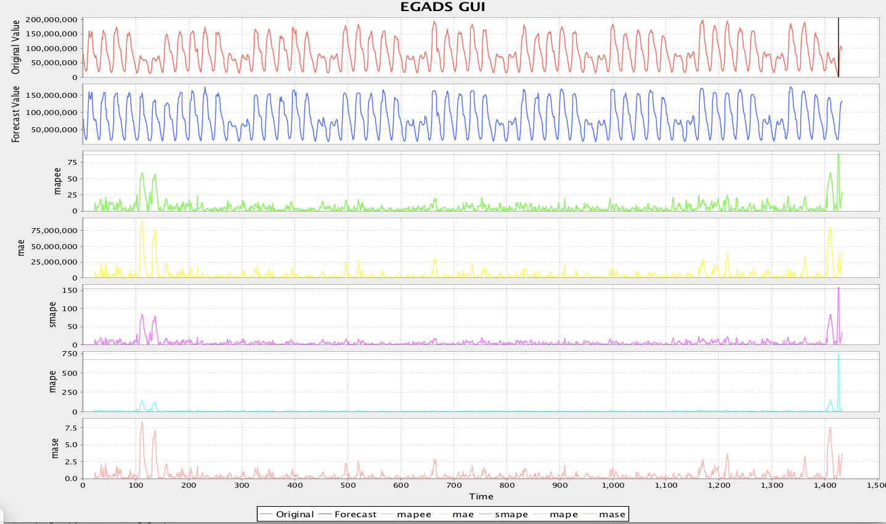
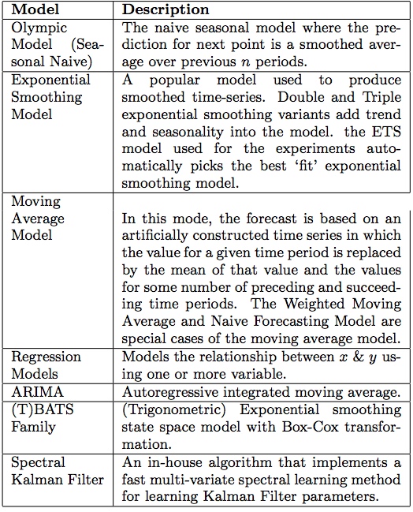
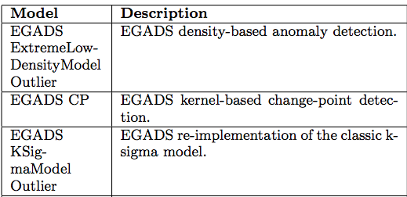

[](https://travis-ci.org/yahoo/egads)

EGADS Java Library
==========================================================

EGADS (Extensible Generic Anomaly Detection System) is an open-source Java package to automatically detect anomalies in large scale time-series data.
EGADS is meant to be a library that contains a number of anomaly detection techniques applicable to many use-cases in a single package with the only dependency being Java.
EGADS works by first building a time-series model which is used to compute the expected value at time *t*. Then a number of errors *E* are computed by comparing the expected
value with the actual value at time *t*. EGADS automatically determines thresholds on *E* and outputs the most probable anomalies. EGADS library can be used in a wide
variety of contexts to detect outliers and change points in time-series that can have a various seasonal, trend and noise components.

How to get started
===========================

EGADS was designed as a self contained library that has a collection of time-series and anomaly detection models
that are applicable to a wide-range of use cases. To compile the library into a single jar, clone the repo and type the following:

```shell
mvn clean compile assembly:single
```

You may have to set you `JAVA_HOME` variable to the appropriate JVM. To do this run:

```shell
export JAVA_HOME=/usr/lib/jvm/{JVM directory for desired version}
```

Usage
==========================

To run a simple example type:

```shell
java -Dlog4j.configurationFile=src/test/resources/log4j2.xml -cp lib/OpenForecast-0.5.0.jar:target/egads-jar-with-dependencies.jar com.yahoo.egads.Egads src/test/resources/sample_config.ini src/test/resources/sample_input.csv
```

which produces the following picture (Note that you can enable this UI by setting `OUTPUT` config key to `GUI` in `sample_config.ini`).



One can also specify config parameters on a command line. For example to do anomaly detection using Olympic Scoring as a time-series model and a density based method as an anomaly detection model use the following.

```shell
java -Dlog4j.configurationFile=src/test/resources/log4j2.xml -cp lib/OpenForecast-0.5.0.jar:target/egads-jar-with-dependencies.jar com.yahoo.egads.Egads "MAX_ANOMALY_TIME_AGO:999999999;AGGREGATION:1;OP_TYPE:DETECT_ANOMALY;TS_MODEL:OlympicModel;AD_MODEL:ExtremeLowDensityModel;INPUT:CSV;OUTPUT:STD_OUT;BASE_WINDOWS:168;PERIOD:-1;NUM_WEEKS:3;NUM_TO_DROP:0;DYNAMIC_PARAMETERS:0;TIME_SHIFTS:0" src/test/resources/sample_input.csv
```

To run anomaly detection using no time-series model with an auto static threshold for anomaly detection, use the following:

```shell
java -Dlog4j.configurationFile=src/test/resources/log4j2.xml -cp lib/OpenForecast-0.5.0.jar:target/egads-jar-with-dependencies.jar com.yahoo.egads.Egads "MAX_ANOMALY_TIME_AGO:999999999;AGGREGATION:1;OP_TYPE:DETECT_ANOMALY;TS_MODEL:NullModel;AD_MODEL:SimpleThresholdModel;SIMPLE_THRESHOLD_TYPE:AdaptiveMaxMinSigmaSensitivity;INPUT:CSV;OUTPUT:STD_OUT;AUTO_SENSITIVITY_ANOMALY_PCNT:0.2;AUTO_SENSITIVITY_SD:2.0" src/test/resources/sample_input.csv
```

Overview
========
While rapid advances in computing hardware and software have led to powerful applications,
still hundreds of software bugs and hardware failures continue to happen in a large cluster
compromising user experience and subsequently revenue. Non-stop systems have a strict uptime
requirement and continuous monitoring of these systems is critical. From the data analysis point of view,
this means non-stop monitoring of large volume of time-series data in order to detect potential faults or anomalies.
Due to the large scale of the problem, human monitoring of this data is practically infeasible which leads us to
automated anomaly detection. An anomaly, or an outlier, is a data point which is significantly different from the rest of
the data. Generally, the data in most applications is created by one or more generating processes that reflect the functionality of a system.

When the underlying generating process behaves in an unusual way, it creates outliers. Fast and efficient identification of these outliers is useful
for many applications including: intrusion detection, credit card fraud, sensor events, medical diagnoses, law enforcement and others.
Current approaches in automated anomaly detection suffer from a large number of false positives which prohibit the usefulness of these systems in practice.
Use-case, or category specific, anomaly detection models may enjoy a low false positive rate for a specific application, but when the characteristics of
the time-series change, these techniques perform poorly without proper retraining.

EGADS (Extensible Generic Anomaly Detection System) enables the accurate and scalable detection of time-series
anomalies. EGADS separates forecasting and anomaly detection two separate components which allows the person to add her own models into any
of the components.

Architecture
===========

The EGADS framework consists of two main components: the time-series modeling module (TMM), the anomaly detection module (ADM).
Given a time-series the TMM component models the time-series producing an expected value later consumed by the ADM that computes anomaly scores.
EGADS was built as a framework to be easily integrated into an existing monitoring infrastructure. At Yahoo,
our internal Yahoo Monitoring Service (YMS) processes millions of data-points every second. Therefore, having a scalable,
accurate and automated anomaly detection for YMS is critical. For this reason, EGADS can be compiled into a single light-weight jar and deployed easily at scale.

The TMM and ADM can be found under `main/java/com/yahoo/egads/models`.

The example of the models supported by TMM and ADM can be found in in the two table below. We expect this collection of models to grow
as more contribution is put forward by the community.

###### List of current TimeSeries Models



###### List of current Anomaly Detection Models



Configuration
=============

Below are the various configuration parameters supported by EGADS.

```
# Only show anomalies no older than this.
# If this is set to 0, then only output an anomaly
# if it occurs on the last time-stamp.
MAX_ANOMALY_TIME_AGO  99999

# Denotes how much should the time-series be aggregated by.
# If set to 1 or less, this setting is ignored.
AGGREGATION	1

# OP_TYPE specifies the operation type.
# Options: DETECT_ANOMALY,
#          UPDATE_MODEL,
#	   TRANSFORM_INPUT
OP_TYPE	DETECT_ANOMALY

# TS_MODEL specifies the time-series
# model type.
# Options: AutoForecastModel
#          DoubleExponentialSmoothingModel
#          MovingAverageModel
#          MultipleLinearRegressionModel
#          NaiveForecastingModel
#          OlympicModel
#          PolynomialRegressionModel
#          RegressionModel
#          SimpleExponentialSmoothingModel
#          TripleExponentialSmoothingModel
#          WeightedMovingAverageModel
# 	   SpectralSmoother
# 	   NullModel
TS_MODEL	OlympicModel

# AD_MODEL specifies the anomaly-detection
# model type.
# Options: ExtremeLowDensityModel
#          AdaptiveKernelDensityChangePointDetector
#          KSigmaModel
#          NaiveModel
#          DBScanModel
#          SimpleThresholdModel
AD_MODEL	ExtremeLowDensityModel

# Type of the simple threshold model.
# Options: AdaptiveMaxMinSigmaSensitivity
#          AdaptiveKSigmaSensitivity
# SIMPLE_THRESHOLD_TYPE

# Specifies the input src.
# Options: STDIN
#          CSV
INPUT	CSV

# Specifies the output src.
# Options: STD_OUT,
#          ANOMALY_DB
#          GUI
#          PLOT
OUTPUT  STD_OUT

# THRESHOLD specifies the threshold for the
# anomaly detection model.
# Comment to auto-detect all thresholds.
# Options: mapee,mae,smape,mape,mase.
# THRESHOLD mape#10,mase#15

#####################################
### Olympic Forecast Model Config ###
#####################################

# The possible time-shifts for Olympic Scoring.
TIME_SHIFTS 0,1

# The possible base windows for Olympic Scoring.
BASE_WINDOWS  24,168

# Period specifies the periodicity of the
# time-series (e.g., the difference between successive time-stamps).
# Options: (numeric)
#          0 - auto detect.
#          -1 - disable.
PERIOD	-1


# NUM_WEEKS specifies the number of weeks
# to use in OlympicScoring.
NUM_WEEKS 8

# NUM_TO_DROP specifies the number of
# highest and lowest points to drop.
NUM_TO_DROP 0

# If dynamic parameters is set to 1, then
# EGADS will dynamically vary parameters (NUM_WEEKS)
# to produce the best fit.
DYNAMIC_PARAMETERS  0

###################################################
### ExtremeLowDensityModel & DBScanModel Config ###
###################################################

# Denotes the expected % of anomalies
# in your data.
AUTO_SENSITIVITY_ANOMALY_PCNT	0.01

# Refers to the cluster standard deviation.
AUTO_SENSITIVITY_SD	3.0

############################
### NaiveModel Config ###
############################

# Window size where the spike is to be found.
WINDOW_SIZE	0.1

#######################################################
### AdaptiveKernelDensityChangePointDetector Config ###
#######################################################

# Change point detection parameters
PRE_WINDOW_SIZE	48
POST_WINDOW_SIZE	48
CONFIDENCE	0.8

###############################
### SpectralSmoother Config ###
###############################

# WINDOW_SIZE should be greater than the size of longest important seasonality.
# By default it is set to 192 = 8 * 24 which is worth of 8 days (> 1 week) for hourly time-series.
WINDOW_SIZE 192

# FILTERING_METHOD specifies the filtering method for Spectral Smoothing
# Options:  		GAP_RATIO		(Recommended: FILTERING_PARAM = 0.01)
#			EIGEN_RATIO		(Recommended: FILTERING_PARAM = 0.1)
#			EXPLICIT		(Recommended: FILTERING_PARAM = 10)
#			K_GAP			(Recommended: FILTERING_PARAM = 8)
#			VARIANCE		(Recommended: FILTERING_PARAM = 0.99)
#			SMOOTHNESS		(Recommended: FILTERING_PARAM = 0.97)
FILTERING_METHOD GAP_RATIO

FILTERING_PARAM 0.01
```

Contributions
================

1. Clone your fork
2. Hack away
3. If you are adding new functionality, document it in the README
4. Verify your code by running `mvn package` and adding additional tests.
5. Push the branch up to GitHub
6. Send a pull request to the yahoo/egads project.

We actively welcome contributions. If you don't know where to start, try
checking out the [issue list](https://github.com/yahoo/egads/issues) and
fixing up the place. Or, you can add a model - a goal of this project
is to have a robust, lightweight and dependency-free set of models to choose from that are ready to
be deployed in production.

References
============
<a href="https://s.yimg.com/ge/labs/v2/uploads/kdd2015.pdf">Generic and Scalable Framework for Automated Time-series Anomaly Detection</a> by Nikolay Laptev, Saeed Amizadeh, Ian Flint , KDD 2015 (August 10, 2015)

Citation
============
If you use EGADS in your projects, please cite:
<a href="https://s.yimg.com/ge/labs/v2/uploads/kdd2015.pdf">Generic and Scalable Framework for Automated Time-series Anomaly Detection</a> by Nikolay Laptev, Saeed Amizadeh, Ian Flint , KDD 2015

BibTeX:

```tex
@inproceedings{laptev2015generic,
		title={Generic and Scalable Framework for Automated Time-series Anomaly Detection},
		author={Laptev, Nikolay and Amizadeh, Saeed and Flint, Ian},
		booktitle={Proceedings of the 21th ACM SIGKDD International Conference on Knowledge Discovery and Data Mining},
		pages={1939--1947},
		year={2015},
		organization={ACM}
}
```

License
=======

Code licensed under the GPL License. See LICENSE file for terms.
